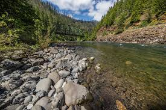

# Stream Temperature Thermal Sensitivity in the Clackamas River Basin, Oregon, USA

**Interactive web application visualizing stream temperature thermal sensitivity across 72 monitoring sites in the Clackamas River Basin, Oregon, USA.**
**Built during 2025 National Science Foundation undergraduate research internship [(NSF REU)](https://www.nsf.gov/funding/initiatives/reu) @ Portland State University under [Dr. Heejun Chang](https://www.pdx.edu/profile/heejun-chang) & [Dr. Christof Teuscher](https://www.pdx.edu/profile/christof-teuscher).**

## Live Demo
Link

## About
Climate change + urbanization has led to increasing stream temperatures that decrease drinking water quality & destroy thermally suitable habitats for cold-water fish like Coho + Chinook salmon. Water suppliers, ecologists, land managers, & riverine researchers can prioritize climate-vulnerable streams + better protect stream ecosystems by analyzing thermal sensitivity values, air-stream temperature time series, & landscape covariates controlling these values across the Clackamas River Basin. 

## Tech Stack
- Next.js + React
- TypeScript
- Leaflet.js: interactive map
- Plotly: temperature time series charts
- Python + R: data management

### Local Development
1. Run the Next.js server: 
```bash
npm install
npm run dev
```
2. Open [http://localhost:3000](http://localhost:3000)